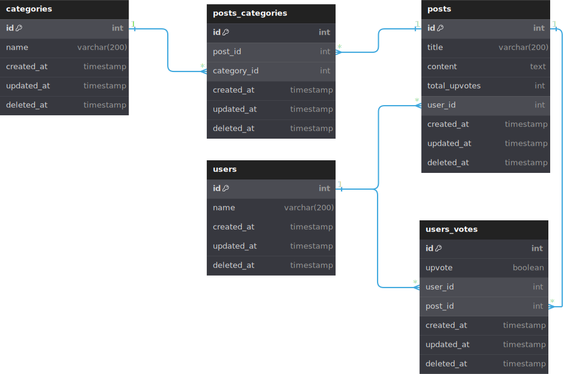

# Microsserviço de posts

Este é um microsserviço desenvolvido para o "if community" visando gerenciar posts e suas categorias.

## Informações

Documentação e tecnologias usadas nesse microsserviço

### Diagrama de Entidade e Realacionamento



Diagrama feito e exportado no editor online [dbdiagram.io](https://dbdiagram.io/home)

> ⚠️ Atenção: Temos um [microsserviço dedicado exclusivamente ao gerenciamento de usuários](https://github.com/IF-Community/if-community-users). No entanto, para garantir a independência de cada serviço, decidimos armazenar algumas informações básicas sobre os usuários também no sistema de posts. Dessa forma, mesmo que o sistema de usuários apresente algum problema, o sistema de posts continuará funcionando sem problemas.

### Tecnologias Utilizadas:
- [Node.js](https://nodejs.org/en)
    - [TypeScript](https://www.typescriptlang.org/): Um superconjunto de JavaScript que adiciona tipagem estática opcional ao código.

    - [Express](https://expressjs.com/pt-br/): Um framework web minimalista e flexível para Node.js, fornecendo um robusto conjunto de recursos para aplicativos web e móveis.

    - [TypeORM](https://typeorm.io/): Um ORM (Object-Relational Mapper) para TypeScript e JavaScript (ES7, ES6, ES5), que permite interagir com bancos de dados de forma eficiente.

    - [Postgres](https://www.postgresql.org/): Um banco de dados relacional e de código aberto, conhecido por sua robustez e desempenho.
    
    - [Zod](https://zod.dev/): Uma biblioteca de TypeScript-first para validação e análise de esquemas, que permite garantir que os dados atendam aos requisitos esperados.

## Instalação de Dependências

### 1. Instale o Node.js (v20.12.2)

Certifique-se de ter o Node.js instalado em sua máquina. 
Você pode baixar e instalar a versão 20.12.2 do Node.js a partir do site oficial: [Node.js Download](https://nodejs.org/en/download/package-manager)

### 2. Instale o Yarn globalmente

Após a instalação do Node.js, execute o seguinte comando no seu terminal para instalar o gerenciador de pacotes Yarn globalmente:

```bash
npm install --global yarn
```

### 3. Instale todas as bibliotecas usadas no projeto

No diretório do seu projeto, execute o seguinte comando para instalar todas as bibliotecas necessárias listadas no arquivo package.json:

```bash
yarn install
```

### 4. Configuração do arquivo .env

Certifique-se de configurar o arquivo .env com as variáveis de ambiente necessárias. 

**Na raiz do projeto crie o arquivo** `.env` ou apenas renomeie o `.env-exemplo` par `.env`

Aqui estão as configurações recomendadas:

```js
HOST=localhost
PORT=5432
BD_USERNAME=postgres
BD_PASSWORD=senha
DATABASE=posts
SYNCHRONIZE=false
LOGGING=false
PORT_API=3000
API_KEY=d6f8e5b2a1c3f9e7d0b5c2a4e6f8a7d3
```
**variaveis que você pode alterar:**
- **PORT:** 
    - Este é o número da porta do banco de dados. Está configurado como 5432, que é a porta padrão para o banco de dados PostgreSQL.
- **BD_USERNAME:** 
    - Este é o nome de usuário usado para se conectar ao banco de dados. Está configurado como postgres, que é um nome de usuário comum para o PostgreSQL.
- **BD_PASSWORD:** 
    - Esta é a senha usada para se autenticar no banco de dados.
- **DATABASE:** 
    - Este é o nome do banco de dados a ser usado.
- **LOGGING:** 
    - Esta variável controla se a saída de log do TypeORM (se estiver sendo usado) está ativada. Está configurado como false, o que significa que os logs do TypeORM estão desativados.
- **PORT_API:**  
    - Este é o número da porta onde o servidor da API será executado. Está configurado como 3000, mas pode ser ajustado conforme necessário para evitar conflitos com outros serviços em execução na máquina.
- **API_KEY**
    - Token de permissão para utilização das rotas. 

### 5. Crie o banco de dados
Crie o banco [Postgres](https://www.postgresql.org/) com o nome utilizado na variável `DATABASE=` do `.env`

**Use o comando abaixo para criar as tabelas no banco**
```bash
yarn migration:run
```

### 6. Gerando Documentação das rotas com swagger

```bash
yarn run swagger
```

### 7. Inicie o servidor de desenvolvimento
Para iniciar o servidor de desenvolvimento, execute o seguinte comando:

```bash
yarn dev
```

### 8. Todas as rotas

Você pode ver e testar todas as rotas acessando o swagger da aplicação em `/api-docs`